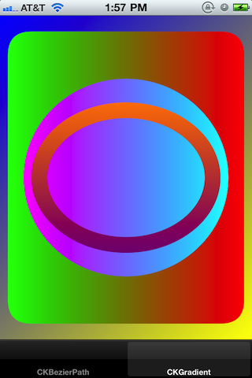

#CrimsonKit

CrimsonKit is licensed under the terms of the Attribution License.  Copyright &copy; 2010-2011, Waqar Malik.

<code>
    CKBezierPath *path = [CKBezierPath bezierPathWithRoundedRect:CGRectInset(rect, 20.0f, 20.0f) cornerRadius:20.0f];
    [path appendPath:[CKBezierPath bezierPathWithOvalInRect:CGRectInset(rect, 30.0f, 30.0f)]];
    [path appendBezierPathWithRect:CGRectInset(rect, 60.0f, 40.0f)];
    path.lineWidth = 3.0f;
    path.usesEvenOddFillRule = NO;
    [[UIColor yellowColor] setFill];
    [[UIColor blueColor] setStroke];
    [path fill];
    [path stroke];
</code>

<code>
    CKGradient *gradient = [[CKGradient alloc] initWithStartingColor:[UIColor colorWithRGBAHex:0x0000ffff] endingColor:[UIColor yellowColor]];
    [gradient drawInRect:rect angle:45.0f];
    [gradient release];

    CKBezierPath *path = [CKBezierPath bezierPathWithRoundedRect:CGRectInset(rect, 10, 20) cornerRadius:30];
    gradient = [[CKGradient alloc] initWithStartingColor:[UIColor colorWithRGBAHex:0x00ff00ff] endingColor:[UIColor redColor]];
    [gradient drawInBezierPath:path angle:0];
    [gradient release];

    path = [CKBezierPath bezierPathWithOvalInRect:CGRectInset(rect, 30, 80)];
    gradient = [[CKGradient alloc] initWithStartingColor:[UIColor cyanColor] endingColor:[UIColor magentaColor]];
    [gradient drawInBezierPath:path angle:180];
    [gradient release];
    CGRect myRect = CGRectInset(rect, 40, 110);
    path = [CKBezierPath bezierPathWithOvalInRect:myRect];
    [path appendPath:[CKBezierPath bezierPathWithOvalInRect:CGRectInset(myRect, 20, 20)]];
    path.usesEvenOddFillRule = YES;
    [path addClip];
    gradient = [[CKGradient alloc] initWithStartingColor:[UIColor orangeColor] endingColor:[UIColor purpleColor]];
    [gradient drawFromPoint:CGPointMake(CGRectGetMinX(myRect), CGRectGetMinY(myRect)) toPoint:CGPointMake(CGRectGetMinX(myRect), CGRectGetMaxY(myRect)) options:0];
    [gradient release];
</code>

